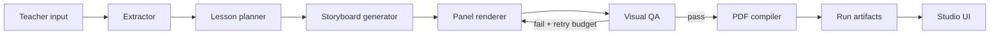

# Architecture

ComicTeach is organized as a small monorepo.

## Core Package

`curriculum_to_comic/` contains the pipeline.

| Module | Role |
| --- | --- |
| `extractors.py` | Topic, markdown, and PDF input adapters |
| `lesson.py` | Lesson-plan generation |
| `storyboard.py` | Six-scene pedagogical storyboard |
| `illustrator.py` | Panel rendering prompt and backend routing |
| `qa.py` | Visual consistency review and rerender suggestions |
| `compiler.py` | Final PDF assembly |
| `models.py` | Pydantic contracts for run artifacts |
| `agent.py` | End-to-end orchestration |

## Studio

`web/` is a FastAPI app with a static browser UI.

| File | Role |
| --- | --- |
| `web/app.py` | Routes, SSE stream, static app mount |
| `web/auth.py` | Password hashing and cookie sessions |
| `web/db.py` | SQLite users, projects, runs, events |
| `web/runner.py` | Background pipeline runner and mock demo runner |
| `web/static/` | Browser UI |

## Showcase Site

`apps/site/` is a Next.js site for public presentation. It uses generated comic
pages in `apps/site/public/showcase` so the first impression is visual, not just
technical.

## Data Flow

1. A user starts a run from the CLI or studio.
2. The extractor normalizes input into a curriculum source.
3. The agent creates `lesson.json`.
4. The agent creates `storyboard.json` and `dialogue.txt`.
5. Panels are rendered to the run folder.
6. QA reviews each panel and can trigger rerendering.
7. The compiler builds the final PDF and `book.json`.
8. The studio records events in SQLite and streams progress to the browser.
